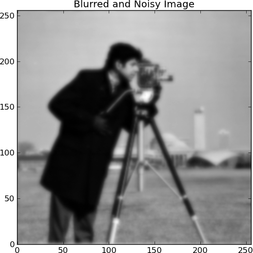
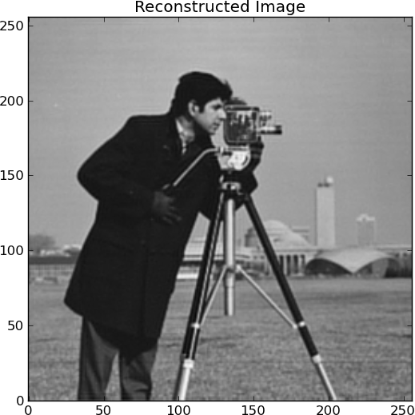
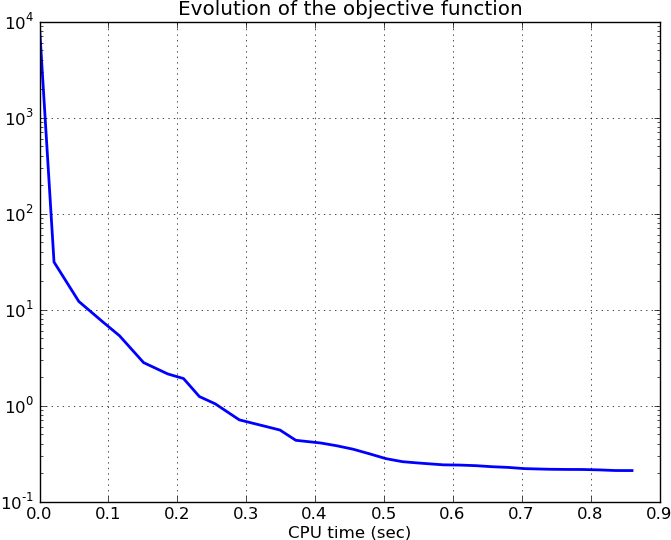
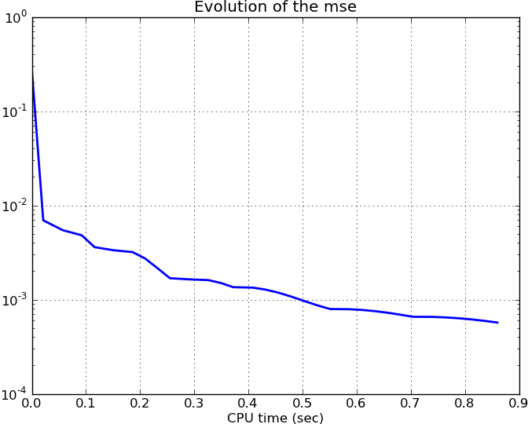

.. _tutorial:

Tutorial
========

Solving problem 701
-------------------

Filename: :file:`examples/demo_wave_DWT_deconv.py`

The following tutorial shows how to solve `problem 
701` (:py:class:`compsense.problems.prob701`)
using the `TwIST` algorithm (:py:class:`compsense.algorithms.TwIST`).

First we need to import the `pycompsense` package::

  >>> import compsense

Then we create the problem object. We can use the
default problem settings or change them. Here we
use a different noise variance::

  >>> P = compsense.problems.prob701(sigma=1e-3)

The problem blurs and adds noise to the `cameraman.jpg`
image

We use the `TwIST` algorithm
to solve the following optimization problem

    .. math::
    
        arg min_x = \frac{1}{2} || y - M B x ||_2^2 + \tau ||x||_1,

where :math:`y,\ M` and :math:`B` (the measured signal, the blurring
operator and the sparsifying basis, respectively) are defined by
the problem object ``P``.
The algorithm object accepts the problem object ``P``
and the algorithm parameters::

  >>> tau = 0.00005
  >>> alg = compsense.algorithms.TwIST(
    ...     P,
    ...     tau,
    ...     stop_criterion=1,
    ...     tolA=1e-3
    ...     )

To solve the problem we need to call the ``solve`` method of
the algorithm::

  >>> x = alg.solve()

The solution of the problem, ``x``, is the coefficients of the
signal in the sparsifying basis. To reconstruct the estimated
signal we use the ``reconstruct`` method of the problem::

  >>> y  = P.reconstruct(x)

We can also display statics of the algorithm. For example we
can display the evolution of the objective of the optimization
problem::

  >>> plt.figure()
  >>> plt.semilogy(alg.times, alg.objectives, lw=2)
  >>> plt.title('Evolution of the objective function')
  >>> plt.xlabel('CPU time (sec)')
  >>> plt.grid(True)

This results in

Or we can display the evolution of the mse error of the
data term in the optimization problem::

  >>> plt.figure()
  >>> plt.semilogy(alg.times, alg.mses, lw=2)
  >>> plt.title('Evolution of the mse')
  >>> plt.xlabel('CPU time (sec)')
  >>> plt.grid(True)

This results in

More examples can be found in the source distribution under the
:file:`examples/` folder.
